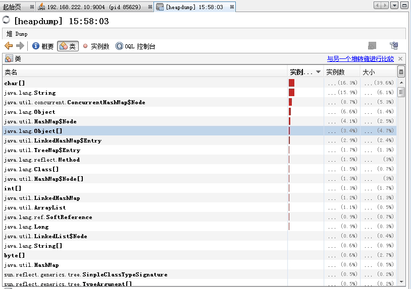
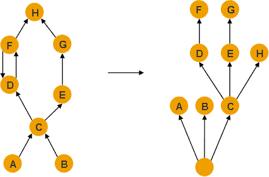

# 为什么要监测Java应用

java开发人员都知道，启动java应用使用的是`java`(`class`文件)或`java -jar`(`jar`或`war`包)命令。而`java`命令其实就是启动一个java虚拟机（`JVM`），程序就是运行在`JVM`上，`JVM`负责类加载，运行时区域堆栈分配等工作，而堆栈分别用于程序中的对象及线程使用，分别影响的系统的cpu及内存，如果程序涉及文件或数据读写，还会影响系统的IO。因此，一个java应用启动后，如果不对它所占用的资源情况进行监测，无疑于一架飞机起飞了，却没有仪表盘，这种飞机估计没有人敢坐。因此，作为开发人员，得清楚应用启动后的运行情况，并能够对应用运行状况进行监测，如此，才能及时预测有可能发生的问题进行及时修正或发生问题后可以更快，更好地找到原因所在，进而解决。可喜的是，程序本身，java工具和第三方工具，都为我们提供了很多监测java应用的方法，因此，作为java开发人员，有必要对它们做一个系统的了解，以便于在实际应用中（特别是在生产环境中）更从容，更有效率的处理问题。

# Java命令的秘密

## Java应用启动

启动java应用使用的是`java`(class文件)或`java -jar`(jar或war包)命令，java命令其实就是生成一个JVM的实例，java应用则运行于此JVM实例中，JVM负责类加载，运行时区域堆栈分配等工作，当应用退出，JVM实例也会关闭。启动多个java应用，也会启动多个JVM实例，它们不会相互影响(但它们都共享同一系统的资源)，这也是为什么使用一个JDK，可以跑多个java应用的背后逻辑。使用java命令启动应用所使用的参数，基本是用于JVM的，JVM实例通过调用某个初始类的main()方法来运行一个Java程序，此方法将作为该程序初始线程的起点，任何其他的线程都是由这个初始线程启动的。在JVM内部有两种线程：守护线程（如垃圾回收线程）和非守护线程（`main`方法线程及用户使用`Thread`创建的线程），当该程序中所有的非守护线程都终止时，JVM实例将自动退出。

## Java应用启动参数说明

java命令究竟有哪些参数可以用，这些参数分别有什么作用，简单的不带参数使用`java`或`java -help`或`java -?`，即可看到此命令的使用方法及参数描述。

使用java命令启动应用所使用的参数，基本是用于JVM的，某种程度上也叫做JVM参数。总的来说，java启动参数共分为三大类，分别是：

- 标准参数(-)：相对稳定的参数，每个版本的JVM都可用。
- 非标准X参数(-X)：默认jvm实现这些参数的功能，但是并不保证所有jvm实现都满足，且不保证向后兼容。
- XX参数(-XX)：此类参数各个jvm实现会有所不同，将来可能会随时取消。

下面将会对这些参数进行说明。

### 标准参数(-)

从前面使用`java -?`可以看到，以`-`开头的参数，都属于标准参数，我们常用的`-help`，`-version`，`-classpath`，`-Dproperty=value`等均属于标准参数。参数详细说明如下：

> -d32及-d64  分别表示应用运行在32位或64位的环境中，使用Java HotSpot Server VM的默认使用的是server模式，而server模式默认使用的是-d64，因此在没有使用此参数时，默认就是-d64。
>
> -server       选择 "server" VM，默认 VM 是 server,表示是在服务器类计算机上运行。
>
> -cp或-classpath <目录和 zip/jar 文件的类搜索路径>linux用":",windows用";"来分隔目录, JAR 档案和 ZIP 档案列表, 用于搜索类文件。使用-classpath后jvm将不再使用CLASSPATH中的类搜索路径，如果-classpath和CLASSPATH都没有设置，则jvm使用当前路径(.)作为类搜索路径。
>
> -D<名称>=<值> 设置系统属性,运行在此jvm之上的应用程序可用System.getProperty(“property”)得到value的值。如果value中有空格，则需要用双引号将该值括起来，如-Dfoo=”foo bar”。该参数通常用于设置系统级全局变量值，如配置文件路径，以便该属性在程序中任何地方都可访问。
>
> -verbose:[class|gc|jni] 启用详细输出，一般在调试和诊断时，都会把gc的详细信息输出
> -version      输出产品版本并退出
> -version:<值> 需要指定的版本才能运行
> -showversion  输出产品版本并继续，即输出版本后，继续按java执行，这是跟-version的区别
> -jre-restrict-search | -no-jre-restrict-search 在版本搜索中包括/排除用户专用 JRE
> -? -help      输出此帮助消息
> -X            输出非标准选项的帮助
> -ea或-enableassertions [:<packagename>...|:<classname>] 按指定的粒度启用断言，默认jvm关闭断言机制
> -da或-disableassertions [:<packagename>...|:<classname>] 禁用具有指定粒度的断言
> -esa | -enablesystemassertions 启用系统断言
> -dsa | -disablesystemassertions 禁用系统断言
> -agentlib:<libname>[=<选项>] 加载本机代理库 <libname>, 例如 -agentlib:hprof
>                   另请参阅 -agentlib:jdwp=help 和 -agentlib:hprof=help
> -agentpath:<pathname>[=<选项>] 按完整路径名加载本机代理库
> -javaagent:<jarpath>[=<选项>] 加载Java编程语言代理, 请参阅 java.lang.instrument
> -splash:<imagepath> 使用指定的图像显示启动屏幕，一般用于图形编程。

由上面描述可，可知道我们常用的`-version`，`-classpath`，`-Dproperty=value`是用于做什么的了。特别提一下`-classpath`（以前遇到由于这个导致运行问题），jvm在加载类时，搜索的路径就是此路径，而它在linux及windows使用的分隔符是不一样的，linux用`:`,windows用`;`来分隔。

### 非标准X参数(-X)

使用命令`java -X`，即可把非标准参数输出，平时使用中，我们用得较多的就是`-Xloggc`，`-Xms`,`-Xmx`,`-Xss`,`-Xmn`了，详细说明如下所示：

> -Xmixed  默认是mixed，使用它们来设置JVM的本地代码编译模式
> -Xint    表示解释执行，所有的字节码将被直接执行，而不会编译成本地码
> -Xcomp   表示第一次使用就编译成本地代码。
> -Xbatch  禁止后台代码编译，强制在前台编译，编译完成之后才能进行代码执行，默认情况下，jvm在后台进行编译，若没有编译完成，则前台运行代码时以解释模式运行
> -Xbootclasspath:    设置搜索路径以引导类和资源，让jvm从指定路径（可以是分号分隔的目录、jar、或者zip）中加载bootclass，用来替换jdk的rt.jar
> -Xbootclasspath/a:  附加在引导类路径末尾
> -Xbootclasspath/p:  置于引导类路径之前，让jvm优先于bootstrap默认路径加载指定路径的所有文件
> -Xcheck:jni    对JNI函数进行附加check；此时jvm将校验传递给JNI函数参数的合法性，在本地代码中遇到非法数据时，jmv将报一个致命错误而终止；使用该参数后将造成性能下降，请慎用。
> -Xfuture   让jvm对类文件执行严格的格式检查（默认jvm不进行严格格式检查），以符合类文件格式规范，推荐开发人员使用该参数
> -Xincgc    开启增量gc（默认为关闭）；这有助于减少长时间GC时应用程序出现的停顿；但由于可能和应用程序并发执行，所以会降低CPU对应用的处理能力
> -Xloggc:file   与-verbose:gc功能类似，只是将每次GC事件的相关情况记录到一个文件中，文件的位置最好在本地，以避免网络的潜在问题。若与verbose命令同时出现在命令行中，则以-Xloggc为准。
> -Xms   指定jvm堆的初始大小，默认为物理内存的1/64，最小为1M；可以指定单位，比如k、m，若不指定，则默认为字节。
> -Xmx   指定jvm堆的最大值，默认为物理内存的1/4或者1G，最小为2M；单位与-Xms一致。
> -Xss   设置单个线程栈的大小，一般默认为512k。
> -Xmn   设置堆(heap)的年轻代的初始值及最大值，单位与-Xms一致，年轻代是存储新对象的地址，也是GC发生得最频繁的地方，若设置过小，则会容易触发年轻代垃圾回收（minor gc），若设置过大，只触发full gc，则占用时间会很长，oracle建议是把年轻代设置在堆大小的四份之一到一半的。这命令同时设置了初始值和最大值，可以使用-XX:NewSize和-XX:MaxNewSiz来分别设置。
> -XshowSettings    显示所有设置并继续

### XX参数(-XX)

此类参数非常丰富，包括高级运行时参数，高级JIT编译参数，高级维护参数和高级GC参数，各个版本jvm实现有可能会有所不同。其中按设置格式，主要分为两类，一种是`boolean`类型，主要用于功能开关，一种是`key-value`类型，主要性能、调试参数等设置，下面列举一些主要使用的参数。

#### boolean类型

此类参数，格式：`-XX:[+-]`，作为功能开关，表示启用或者禁用属性。以下列举一些：

> -XX:+PrintFlagsFinal  输出参数的最终值
> -XX:+PrintFlagsInitial 输出参数的默认值
> -XX:-DisableExplicitGC  禁止调用System.gc()；但jvm的gc仍然有效
> -XX:+MaxFDLimit 最大化文件描述符的数量限制
> -XX:+ScavengeBeforeFullGC   新生代GC优先于Full GC执行
> -XX:+UseGCOverheadLimit 在抛出OOM之前限制jvm耗费在GC上的时间比例
> -XX:-UseConcMarkSweepGC 对老生代采用并发标记交换算法进行GC
> -XX:-UseParallelGC  启用并行GC
> -XX:-UseParallelOldGC   对Full GC启用并行，当-XX:-UseParallelGC启用时该项自动启用
> -XX:-UseSerialGC    启用串行GC
> -XX:+UseThreadPriorities    启用本地线程优先级
> -XX:-UseG1GC    启用G1的GC

#### key-value类型

此类参数，格式：`-XX:=`表示属性name的值为value。在性能调优和调试监测时，会经常用到。

##### 性能调优

性能调优时，主要是对JVM的内存分配情况的调优，包括堆大小，年轻代大小，年轻年老代比例等等。

> -XX:LargePageSizeInBytes=4m 设置用于Java堆的大页面尺寸
> -XX:MaxHeapFreeRatio=70 GC后java堆中空闲量占的最大比例
> -XX:MaxNewSize=size 新生成对象能占用内存的最大值
> -XX:MaxPermSize=64m 老生代对象能占用内存的最大值
> -XX:MinHeapFreeRatio=40 GC后java堆中空闲量占的最小比例
> -XX:NewRatio=2  新生代内存容量与老生代内存容量的比例
> -XX:NewSize=2.125m  新生代对象生成时占用内存的默认值
> -XX:ReservedCodeCacheSize=32m   保留代码占用的内存容量
> -XX:ThreadStackSize=512 设置线程栈大小，若为0则使用系统默认值
> -XX:+UseLargePages  使用大页面内存

##### 调试监测

在需要对应用进行监测，特别是观察GC情况，OOM后检查问题等。

> -XX:-CITime 打印消耗在JIT编译的时间
> -XX:ErrorFile=./hs_err_pid<pid>.log 保存错误日志或者数据到文件中
> -XX:-ExtendedDTraceProbes   开启solaris特有的dtrace探针
> -XX:HeapDumpPath=./java_pid<pid>.hprof  指定导出堆信息时的路径或文件名
> -XX:-HeapDumpOnOutOfMemoryError 当首次遭遇OOM时导出此时堆中相关信息
> -XX:OnError="<cmd args>;<cmd args>" 出现致命ERROR之后运行自定义命令
> -XX:OnOutOfMemoryError="<cmd args>;<cmd args>"  当首次遭遇OOM时执行自定义命令
> -XX:-PrintClassHistogram    遇到Ctrl-Break后打印类实例的柱状信息，与jmap -histo功能相同
> -XX:-PrintConcurrentLocks   遇到Ctrl-Break后打印并发锁的相关信息，与jstack -l功能相同
> -XX:-PrintCommandLineFlags  打印在命令行中出现过的标记
> -XX:-PrintCompilation   当一个方法被编译时打印相关信息
> -XX:-PrintGC    每次GC时打印相关信息
> -XX:-PrintGC Details    每次GC时打印详细信息
> -XX:-PrintGCTimeStamps  打印每次GC的时间戳
> -XX:-TraceClassLoading  跟踪类的加载信息
> -XX:-TraceClassLoadingPreorder  跟踪被引用到的所有类的加载信息
> -XX:-TraceClassResolution   跟踪常量池
> -XX:-TraceClassUnloading    跟踪类的卸载信息
> -XX:-TraceLoaderConstraints 跟踪类加载器约束的相关信息

## 常用Java应用启动参数

### 常用标准参数

- `-version`，场景：想查看JDK版本，`java -version`。
- `-D<名称>=<值>`，场景:maven跳过单元测试，使用`java -Dmaven.test.skip=true`,
- `-cp或-classpath`, 场景：设置需要加载的jar包位置，使用`java -cp lib/test.jar com.test.TestMain`
- `-verbose:gc`, 场景：输出GC详细信息

### 常用X参数

- `-Xms`和`-Xmx`，场景：由于内存不足发生oom，调大堆大小，如设置为1G，可以`java -Xms1024m -Xmx1024m`，通常为了避免频繁发生GC，`-Xms`和`-Xmx`设置为一致。
- `-Xss`，场景：线程操作数及局部变量多，把线程栈的大小调大，可以`java -Xss1024k`
- `-Xmn`，场景：年轻代大小设置为512m，可以`java -Xmn512m`
- `-Xloggc:file`，场景：将每次GC事件的相关情况记录到一个文件中以便于后续分析，可以`java -Xloggc:logs/gc.log`

### 常用XX参数

打印GC相关的内容，包括堆情况，GC详情，GC时间，发生OOM时，生成快照，发生错误是记录错误日志等，如下：

- `-XX:+PrintHeapAtGC`
- `-XX:+PrintGCDetails`
- `-XX:+PrintGCDateStamps`
- `-XX:+PrintGCTimeStamps`
- `-XX:+PrintTenuringDistribution`
- `-XX:+PrintGCApplicationStoppedTime`
- `-XX:+HeapDumpOnOutOfMemoryError`
- `-XX:HeapDumpPath=logs/heapdump.hprof`，发生OOM时，dump出快照到文件`heapdump.hprof`中。
- `-XX:ErrorFile=logs/java_error_%p.log`，发生JVM错误时，把日志输出到`java_error_%p.log`中。

以上参数均是使用度很高的参数，在使用`java`命令启动应用时，可以把这些参数加上，以便于后续调优与问题诊断。

# Java命令行工具

监测java应用，最方便的就是直接使用jdk提供的现成工具，在jdk的安装的bin目录下，已经提供了多种命令行监测工具，以便于开发人员和运维人员监测java应用和诊断问题，因此，此类工具是java应用监测的重要手段。也是作为java开发人员需要掌握的基本技能。

## 常用监测命令行工具

一般来说，常用的命令行工具包括`jps`,`jinfo`,`jmap`,`jstack`,`jstat`，这些工具都在`JAVA_HOME/bin/`目录下，概要说明如下：

- `jps`查看java进程ID
- `jinfo`查看及调整虚拟机参数
- `jmap`查看堆(heap)使用情况及生成堆快照
- `jstack`查看线程运行状态及生成线程快照
- `jstat`显示进程中的类装载、内存、垃圾收集等运行数据。

通过这些工具，基本上可以了解java应用的内存变化状态，线程运行状态等信息，进而为应用监测及问题诊断提供依据。

## 进程查询工具jps

### jps说明

要监测java应用，第一步就是先知道这个应用是哪个进程，它的运行参数是什么。`jps`就是可以查询进程的工具。熟悉linux的同学，大概都知道查询进程使用`ps -ef|grep java`这样的命令，jps也类似，但它不使用名称查找，而是查找全部当前jdk运行的java进程，而且只查找当前用户的Java进程，而不是当前系统中的所有进程。

### jps使用

作为命令行工具，可以通过`-help`参数查看帮助。

```shell
[root@test bin]# jps -help
usage: jps [-help]
       jps [-q] [-mlvV] [<hostid>]

Definitions:
    <hostid>:      <hostname>[:<port>]

参数解释：
-q：只显示java进程的pid
-m：输出传递给main方法的参数，在嵌入式jvm上可能是null
-l：输出应用程序main class的完整package名 或者 应用程序的jar文件完整路径名
-v：输出传递给JVM的参数
```


只输出进程ID

```shell
[root@test bin]# jps -q
13680
14214
```


输出程序完整名称及JVM参数

```shell
[root@test bin]# jps -lv
13680 java-monitor-example-0.0.1-SNAPSHOT.jar -Xms128m -Xmx128m -Dserver.port=8083
14289 sun.tools.jps.Jps -Denv.class.path=.:/opt/jdk8/lib:/opt/jdk8/jre/lib -Dapplication.home=/opt/jdk8
```


输出的内容中，java-monitor-example-0.0.1-SNAPSHOT.jar是-l输出的完整名称，-Xms128m -Xmx128m -Dserver.port=8083是传给JVM的参数。

在shell脚本中使用命令获取java进程ID并作为变量使用

```shell
JAVA_HOME="/opt/jdk8"
APP_MAINCLASS=java-monitor-example
#初始化psid变量（全局）
psid=0

#查看进程ID函数
checkpid() {
   javaps=`$JAVA_HOME/bin/jps -l | grep $APP_MAINCLASS`
 
   if [ -n "$javaps" ]; then
      psid=`echo $javaps | awk '{print $1}'`
   else
      psid=0
   fi
}

#调用函数后通过psid进行业务逻辑操作，如根据进程id杀进程
checkpid
echo "(pid=$psid)"
```

上述脚本，比较适合运维人员对应用的开启和关闭，自动获取java进程ID，然后根据ID判断程序是否运行(start)，或者关闭应用(`kill -9`)。

## 配置信息工具jinfo

### jinfo说明

java的启动参数有很多，监测java应用前需要了解清楚它的启动参数是什么。这时就需要用到`jinfo`工具。`jinfo`可以输出JAVA应用的系统参数和JVM参数。jinfo还能够修改一部分运行期间能够调整的虚拟机参数，很多运行参数是不能调整的，如果出现”cannot be changed”异常，说明不能调整。不过官方文档指出，这个命令在后续的版本中可能不再使用，当前JDK8还是可以用的。

### jinfo使用

```shell
[root@test bin]# jinfo -help
Usage:
    jinfo [option] <pid>
        (to connect to running process)

where <option> is one of:
    -flag <name>         to print the value of the named VM flag
    -flag [+|-]<name>    to enable or disable the named VM flag
    -flag <name>=<value> to set the named VM flag to the given value
    -flags               to print VM flags
    -sysprops            to print Java system properties
    <no option>          to print both of the above
    -h | -help           to print this help message
```


使用`jps`获取到应用的进程ID后(示例的PID为13680)，如果直接`jps `则会输出全部的系统参数和JVM参数，其它参数说明在`help`中也说得很清楚了。

获取java应用的堆初始值

```shell 
[root@test bin]# jinfo -flag InitialHeapSize 13680
-XX:InitialHeapSize=134217728
```


查看全部的JVM参数

```shell
[root@test bin]# jinfo -flags 13680
Attaching to process ID 13680, please wait...
Debugger attached successfully.
Server compiler detected.
JVM version is 25.51-b03
Non-default VM flags: -XX:CICompilerCount=2 -XX:InitialHeapSize=134217728 -XX:MaxHeapSize=134217728 -XX:MaxNewSize=44564480 -XX:MinHeapDeltaBytes=524288 -XX:NewSize=44564480 -XX:OldSize=89653248 -XX:+UseCompressedClassPointers -XX:+UseCompressedOops -XX:+UseFastUnorderedTimeStamps -XX:+UseParallelGC
Command line:  -Xms128m -Xmx128m -Dserver.port=8083
```


可见，由于我们启动时设置了`-Xms`和`-Xmx`，它们对应的就是`-XX:InitialHeapSize`及`-XX:MaxHeapSize`值。另外，参数`-Dserver.port`属于系统参数，使用`jinfo -sysprops 13680`就可以查看系统参数了。

## 堆内存查看工具jmap

### jmap说明

java应用启动后，它在JVM中运行，内存是需要重点监测的地方，`jmap`就是这样的一个工具，它可以获取运行中的jvm的堆的快照，包括整体情况，堆占用情况的直方图，dump出快照文件以便于离线分析等。官方文档指出，这个命令在后续的版本中可能不再使用，当前JDK8还是可以用的。

### jmap使用

```shell
[root@test bin]# jmap -help
Usage:
    jmap [option] <pid>
        (to connect to running process)

where <option> is one of:
    <none>               to print same info as Solaris pmap
    -heap                to print java heap summary
    -histo[:live]        to print histogram of java object heap; if the "live"
                         suboption is specified, only count live objects
    -clstats             to print class loader statistics
    -finalizerinfo       to print information on objects awaiting finalization
    -dump:<dump-options> to dump java heap in hprof binary format
                         dump-options:
                           live         dump only live objects; if not specified,
                                        all objects in the heap are dumped.
                           format=b     binary format
                           file=<file>  dump heap to <file>
                         Example: jmap -dump:live,format=b,file=heap.bin <pid>
    -F                   force. Use with -dump:<dump-options> <pid> or -histo
                         to force a heap dump or histogram when <pid> does not
                         respond. The "live" suboption is not supported
                         in this mode.
    -h | -help           to print this help message
    -J<flag>             to pass <flag> directly to the runtime system
```

如上所示，`jmap`参数常用的是`-heap`,`-histo`和`-dump`。

打印jvm内存整体使用情况

```shell
[root@test bin]# jmap -heap 13680
Attaching to process ID 13680, please wait...
Debugger attached successfully.
Server compiler detected.
JVM version is 25.51-b03

using thread-local object allocation.
Parallel GC with 2 thread(s)

Heap Configuration:
   MinHeapFreeRatio         = 0
   MaxHeapFreeRatio         = 100
   MaxHeapSize              = 134217728 (128.0MB)
   NewSize                  = 44564480 (42.5MB)
   MaxNewSize               = 44564480 (42.5MB)
   OldSize                  = 89653248 (85.5MB)
   NewRatio                 = 2
   SurvivorRatio            = 8
   MetaspaceSize            = 21807104 (20.796875MB)
   CompressedClassSpaceSize = 1073741824 (1024.0MB)
   MaxMetaspaceSize         = 17592186044415 MB
   G1HeapRegionSize         = 0 (0.0MB)

Heap Usage:
PS Young Generation
Eden Space:
   capacity = 31981568 (30.5MB)
   used     = 5306632 (5.060798645019531MB)
   free     = 26674936 (25.43920135498047MB)
   16.59278244268699% used
From Space:
   capacity = 6291456 (6.0MB)
   used     = 1081440 (1.031341552734375MB)
   free     = 5210016 (4.968658447265625MB)
   17.18902587890625% used
To Space:
   capacity = 6291456 (6.0MB)
   used     = 0 (0.0MB)
   free     = 6291456 (6.0MB)
   0.0% used
PS Old Generation
   capacity = 89653248 (85.5MB)
   used     = 16615680 (15.845947265625MB)
   free     = 73037568 (69.654052734375MB)
   18.533271655701753% used

18006 interned Strings occupying 2328928 bytes.
```

从以上信息，可以看出JVM中堆内存当前的使用情况，包括年轻代（`Eden`区，`From`区，`To`区）和年老代。

查看类名，对象数量，对象占用大小直方图

```shell
[root@test bin]# jmap -histo:live 13680|more

 num     #instances         #bytes  class name
----------------------------------------------
   1:         36536        6462912  [C
   2:         35557         853368  java.lang.String
   3:          7456         826968  java.lang.Class
   4:         20105         643360  java.util.concurrent.ConcurrentHashMap$Node
   5:          1449         469024  [B
   6:          6951         399280  [Ljava.lang.Object;
   7:          9311         297952  java.util.HashMap$Node
   8:          3122         274736  java.lang.reflect.Method
   9:          2884         269112  [I
  10:          6448         257920  java.util.LinkedHashMap$Entry
  11:          2994         255160  [Ljava.util.HashMap$Node;
  12:         15249         243984  java.lang.Object

.....
.....
```

如上所示，使用`-histo`输出包括序号，实例数，占用字节数和类名称。具体说明如下：

> instances列：表示当前类有多少个实例。
> bytes列：说明当前类的实例总共占用了多少个字节
> class name列：表示的就是当前类的名称，class name 解读：
> B代表byte
> C代表char
> D代表double
> F代表float
> I代表int
> J代表long
> Z代表boolean
> [代表数组，如[I相当于int[]
> 对象用[L+类名表示

把内存情况dump内存到本地文件

```shell
[root@test bin]# jmap -dump:file=./heap.hprof 13680
```

如上所示，会把堆情况写入到当前目录的`heap.hprof`文件中，至于如何分析此文件，可以使用`jhat`，但一般实际开发中，很少使用jhat来直接对内存dump文件进行分析，因此不再对它进行讲述。更多的是使用工具`MAT`，以可视化的方式来查看，后续部分将会对`MAT`工具的使用进行详细讲解。

## 线程查询工具jstack

### jstack说明

此命令打印指定Java应用的线程堆栈，对于每个Java帧，将打印完整的类名，方法名，字节代码索引（BCI）和行号，可以用于检测死锁，线程停顿，进程耗用cpu过高报警问题等排查。

### jstack使用

```shell
[root@test bin]# jstack -help
Usage:
    jstack [-l] <pid>
        (to connect to running process)
    jstack -F [-m] [-l] <pid>

Options:
    -F  强制dump线程堆栈信息. 用于进程hung住， jstack <pid>命令没有响应的情况
    -m  同时打印java和本地(native)线程栈信息，m是mixed mode的简写
    -l  打印锁的额外信息
```

可以打印线程信息（一般都会把打印的内容写入到文件然后再分析），如下：

打印当前线程堆栈信息

```shell
[root@test bin]# jstack 13680
2019-08-16 23:18:18
Full thread dump Java HotSpot(TM) 64-Bit Server VM (25.51-b03 mixed mode):
"http-nio-8083-Acceptor-0" #39 daemon prio=5 os_prio=0 tid=0x00007f7520698800 nid=0x359a runnable [0x00007f7508bb7000]
   java.lang.Thread.State: RUNNABLE
	at sun.nio.ch.ServerSocketChannelImpl.accept0(Native Method)
	at sun.nio.ch.ServerSocketChannelImpl.accept(ServerSocketChannelImpl.java:422)
	at sun.nio.ch.ServerSocketChannelImpl.accept(ServerSocketChannelImpl.java:250)
	- locked <0x00000000f8c85380> (a java.lang.Object)
	at org.apache.tomcat.util.net.NioEndpoint.serverSocketAccept(NioEndpoint.java:448)
	at org.apache.tomcat.util.net.NioEndpoint.serverSocketAccept(NioEndpoint.java:70)
	at org.apache.tomcat.util.net.Acceptor.run(Acceptor.java:95)
	at java.lang.Thread.run(Thread.java:745)
```

### 线程dump分析

#### 线程状态

java线程栈使用`jstack`dump出来后，可以看到线程的状态，线程状态一共分6种，可以参考[官方文档](https://docs.oracle.com/javase/8/docs/technotes/guides/troubleshoot/tooldescr034.html)：`https://docs.oracle.com/javase/8/docs/technotes/guides/troubleshoot/tooldescr034.html`，下面是它的状态说明：

- NEW

线程已经new出来创建了，但是还没有启动(not yet started),`jstack`不会打印这个状态的线程信息。

- RUNNABLE

正在Java虚拟机下跑任务的线程的状态，但其实它是只是表示线程是可运行的（ready）。对于单核的CPU，多个线程在同一时刻，只能运行一个线程，其它的则需要等CPU的调度。

- BLOCKED

线程处于阻塞状态，正在等待一个锁，多个线程共用一个锁，当某线程正在使用这个锁进入某个synchronized同步方法块或者方法，而此线程需要进入这个同步代码块，也需要这个锁，则导致本线程处于阻塞状态。

- WAITING

等待状态，处于等待状态的线程是由于执行了3个方法中的任意方法。 1. `Object.wait`方法，并且没有使用timeout参数; 2. `Thread.join`方法，没有使用timeout参数 3. `LockSupport.park`方法。 处于waiting状态的线程会等待另外一个线程处理特殊的行为。一个线程处于等待状态(wait，通常是在等待其他线程完成某个操作（notify或者notifyAll）。注意，`Object.wait()`方法只能够在同步代码块中调用。调用了`wait()`方法后，会释放锁。

- TIMED_WAITING

线程等待指定的时间，对于以下方法的调用，可能会导致线程处于这个状态：1. Thread.sleep方法 2. `Object.wait`方法，带有时间 3. `Thread.join`方法，带有时间 4. `LockSupport.parkNanos`方法，带有时间 5. `LockSupport.parkUntil`方法，带有时间。注意，`Thread.sleep`方法调用后，它不会释放锁，仍然占用系统资源。

- TERMINATED

线程中止的状态，这个线程已经完整地执行了它的任务。

从下面这张图可以看出线程状态的变化情况:


#### 分析jstack后线程栈内容

从前面使用`jstack` dump出来信息，我们需要知道以下几个信息：

- `"http-nio-8083-Acceptor-0" #39`：是线程的名字，因此，一般我们创建线程时需要设置自己可以辩识的名字。
- `daemon` 表示线程是否是守护线程
- `prio` 表示我们为线程设置的优先级
- `os_prio` 表示的对应的操作系统线程的优先级，由于并不是所有的操作系统都支持线程优先级，所以可能会出现都置为0的情况
- `tid` 线程的id
- `nid` 线程对应的操作系统本地线程id，每一个java线程都有一个对应的操作系统线程，它是16进制的，因此一般在操作系统中获取到线程ID后，需要转为16进制，来对应上。
- `java.lang.Thread.State: RUNNABLE` 运行状态，上面已经介绍了线程的状态，若是WAITING状态，则括号中的内容说明了导致等待的原因，如parking说明是因为调用了LockSupport.park方法导致等待。通常的堆栈信息中，都会有lock标记，如`- locked <0x00000000f8c85380> (a java.lang.Object)`表示正在占用这个锁。
- 对于线程停顿，CPU占用等问题，可以重点看一下`wait`状态的线程
- 对于死锁，在Dump出来的线程栈快照可以直接报告出Java级别的死锁。

## JVM统计数据工具jstat

### jstat说明

`jstat`即`JVM Statistics Monitoring Tool`，即JVM统计监测工具，包括监测类装载、内存、垃圾收集、JIT编译等运行数据，在没有图形的服务器上，它是运行期定位虚拟机性能问题的首选工具。

### jstat使用

```shell
[root@test bin]# jstat -help
jstat -<option> [-t] [-h<lines>] <vmid> [<interval> [<count>]]
Usage: jstat -help|-options
       jstat -<option> [-t] [-h<lines>] <vmid> [<interval> [<count>]]

Definitions:
  <option>      An option reported by the -options option
  <vmid>        Virtual Machine Identifier. A vmid takes the following form:
                     <lvmid>[@<hostname>[:<port>]]
                Where <lvmid> is the local vm identifier for the target
                Java virtual machine, typically a process id; <hostname> is
                the name of the host running the target Java virtual machine;
                and <port> is the port number for the rmiregistry on the
                target host. See the jvmstat documentation for a more complete
                description of the Virtual Machine Identifier.
  <lines>       Number of samples between header lines.
  <interval>    Sampling interval. The following forms are allowed:
                    <n>["ms"|"s"]
                Where <n> is an integer and the suffix specifies the units as
                milliseconds("ms") or seconds("s"). The default units are "ms".
  <count>       Number of samples to take before terminating.
  -J<flag>      Pass <flag> directly to the runtime system.
```

以上所示，`vmid`、`interval`、`count`分别是进程号，打印间隔时间（s或ms），打印次数，其中`option`参数主要是以下（也可以使用命令`jstat -option`查看）：

- `-class` 统计class loader行为信息 ，如总共加载了多少个类
- `-compile` 统计HotSpot Just-in-Time编译器的行为
- `-gc` 统计jdk gc时heap信息
- `-gccapacity` 统计不同的generations相应的heap容量情况
- `-gccause` 统计gc的情况，（同-gcutil）和引起gc的事件
- `-gcnew` 统计gc时，新生代的情况
- `-gcnewcapacity` 统计gc时，新生代heap容量
- `-gcold` 统计gc时，老年区的情况
- `-gcoldcapacity` 统计gc时，老年区heap容量
- `-gcpermcapacity` 统计gc时，permanent区heap容量
- `-gcutil` 统计gc时，heap情况
- `-printcompilation` hotspot编译方法统计

一般我们使用`-class`，`-gc`，`-gccause`和`-gcutil`比较多，主要用于来分析类和堆使用情况及gc情况。

### 监测JVM的GC情况

以上述的示例工程`java-monitor-example`为例，里面包含了一个函数来测试内存溢出（使用一个数组，循环创建对象，直到内存溢出）。使用`jstat -gc 13680 1000`即每秒监测一次，调用`/monitor/user/oom`接口后，即看到堆和GC变化情况。为方便查看，我把输出放到sublime中显示，如下所示：


日志输出OOM报错：


以上输出的内容，每列的说明如下：

- `S0C` 当前年轻代中第一个survivor（s0）的总容量 (KB).
- `S1C` 当前年轻代中第一个survivor（s1）的总容量 (KB).
- `S0U` s0已使用的容量 (KB).
- `S1U` s1已使用的容量 (KB).
- `EC` 当前年轻代中eden区总容量 (KB).
- `EU` eden区已经使用的容量 (KB).
- `OC` 年老代的容量总容量 (KB).
- `OU` 年老代已使用容量(KB).
- `MC` 当前 Metaspace总容量(KB).
- `MU` 当前 Metaspace已使用容量 (KB).
- `CCSC` Compressed class容量大小
- `CCSU` Compressed class已使用容量
- `YGC` 从应用启动时到现在，年轻代young generation 发生GC Events的总次数.
- `YGCT` 从应用启动时到现在， 年轻代Young generation 垃圾回收的总耗时.
- `FGC` 从应用启动时到现在， full GC事件总次数.
- `FGCT` 从应用启动时到现在， Full sc总耗时.
- `GCT` 从应用启动时到现在， 垃圾回收总时间. GCT=YGCT+FGCT

从以上输出第6行可以看出，`EC`和`EU`，`OC`和`OU`表示年轻代、年老代的内存都已经用完(与容量数值相等)，发生OOM。这时，则需要采取措施，增大内存（-Xmx参数）或者找到导致OOM的代码进行修改。

# 线上问题排查套路

## CPU问题排查

如果发现系统变慢变卡，应用响应变慢，首先要查的就是CPU使用情况，一般是进程占用CPU过高，因此需要监测CPU的占用情况，而java应用中与CPU相关的主要是线程的运行，因此具体到java应用，需要监测线程的运行状态，对应就是命令行工具`jstack`。因此，总结CPU占用过高问题可按下面套路：

```shell
# (1) 查询CPU占用高的进程ID(PID)
top -c

# (2) 了解此进程的启动参数
ps -ef|grep  PID
或者
jinfo -flags PID

# (3) 打印线程堆栈信息并输出文件
jstack -l PID > PID.dump

# (4) 根据进程查找线程ID（TID）
top -H -p PID

# (5) 获取TID的16进制数
printf "%x\n" TID

# (6) 结合TID和线程堆栈信息文件查找问题
- 可以使用文本工具直接查看
- 可以使用 grep TID -A20 PID.dump 来查看
- 需要配合线程状态来检查
```

## 内存问题排查

内存问题主要是java应用在运行过程中发生OOM（out of memory），因此需要建议在java应用启动时，添加几个参数，包括`-Xloggc:file -XX:+HeapDumpOnOutOfMemoryError -XX:HeapDumpPath=logs/heapdump.hprof -XX:ErrorFile=logs/java_error_%p.log`。这样当发生oom时，可以从dump出来的文件来分析oom的原因。与内存问题相关的java命令行工具包括`jmap`,`jstat`，因此内存OOM问题排查套路如下：

```shell
# (1)找到java应用进程(PID)
jps -lvm
或者
top -c

# (2)了解此进程启动参数（特别是-Xms，-Xmx等）
ps -ef|grep  PID
或者
jinfo -flags PID

# (3) 确认内存情况
jmap -heap PID

# (4) 查找占内存的大对象
jmap -histo:live PID 

# (5) dump出堆文件，以便使用工具分析
jmap -dump:file=./heap.hprof PID

# (6) 查看GC变化情况，如下每秒打印一次
jstat -gc PID 1000 

# (7) 结合日志文件出错信息及dump出来的堆文件分析OOM和GC情况
- 内存分配小，适当调整内存
- 对象被频繁创建，且不释放，优化代码
- young gc频率太高，查看-Xmn、-XX:SurvivorRatio等参数设置是否合理
```

关于OOM，[官方文档](https://docs.oracle.com/javase/8/docs/technotes/guides/troubleshoot/memleaks002.html)有关于OOM的说明（`https://docs.oracle.com/javase/8/docs/technotes/guides/troubleshoot/memleaks002.html`）， 主要分为以下几大类：

- `java.lang.OutOfMemoryError: Java heap space`，堆的内存占用已经达到`-Xmx`设置的最大值，无法创建新对象，简单的可以考虑通过调整`-Xmx`参数来解决。
- `java.lang.OutOfMemoryError: GC Overhead limit exceeded`，表示GC一直在执行且java进程运行很慢，通常会抛出此异常，java堆的分配的空间很小以至于新数据无法放到堆中。考虑调整堆大小，如果想关闭此输出，可用参数来关闭`-XX:-UseGCOverheadLimit`。
- `java.lang.OutOfMemoryError: Requested array size exceeds VM limit`，java应用尝试分配大于堆大小的数组，如堆大小是256M，却要分配512M的数组，则会报错。考虑调整堆大小或者修改代码
- `java.lang.OutOfMemoryError: Metaspace`，当类元数据所需的本机内存量超过时MaxMetaSpaceSize时报出，考虑调整MaxMetaSpaceSize。
- `java.lang.OutOfMemoryError: request size bytes for reason. Out of swap space?`当来自本机堆的分配失败并且本机堆可能接近耗尽时会报此错误，需要查看日志来处理。
- `java.lang.OutOfMemoryError: Compressed class space`，JVM的非堆结构中，类指针存放空间不足，考虑使用`CompressedClassSpaceSize`来调整。
- `java.lang.OutOfMemoryError: reason stack_trace_with_native_method`，JVM的本地方法区不足，在Java本机接口（JNI）或本机方法中检测到分配失败，需要查找对应堆栈信息来查询。

## 磁盘及IO问题排查

java应用运行过程中，会涉及日志产生，对磁盘的读写等操作，也有可能有各种问题，如磁盘不足（日志输出过多）、磁盘读写IO比较慢、IO过于频繁等。一般来说，可以按以下套路进行排查：

```shell
# (1) 查看磁盘容量情况
df -h

# (2) 查看文件大小和目录大小
ls -l 或者直接ll
du -h --max-depth=1

# (3) 查看IO情况，找到IO读写频繁的进程PID
iotop -d 1 # 1秒打印一次
或者
iostat -d -x -k 1 #1秒打印一次

# (4) 使用stack打印线程堆栈信息，排查IO相关代码

# (5) 有时候若想测试磁盘的读写速度（特别是虚拟机），可以使用dd
# 示例：测数据卷挂载目录的纯写速度
dd if=/dev/zero of=/数据卷目录/test.iso bs=8k count=1000000
```

## 业务问题排查

业务问题，主要是涉及到代码逻辑层面的，主要是查询日志输出，方法是否按正确的逻辑执行，因此一般的排查套路如下：

```shell
# (1) 实时日志输出查询
tail -fn 100 log_file

# (2) 根据日志输出的关键字来定位问题
grep keyWord log_file # 关键字所在行
grep -C n keyWord log_file # 关键字所在前后n行

# (3) 日志文件使用可视化文本工具分析（notepad++，sublime，大文件查看如EmEditor）

# (4) 使用线上工具直接检测方法的参数、返回值，异常情况等等，如Btrace，arthas等。
```

# 可视化监测工具

## jconsole使用

jconsole是jdk一个内置Java性能分析器，在JDK安装目录下的bin目录，在windows下，可以从命令行(`jconsole.exe`)或直接双击jconsole.exe启动运行。

### 两种连接方式

jconsole启动时，会提供两种连接方式，分别是连接本地进程和连接远程进程。它会直接列出本地java进程来选择。若是需要监测远程的java进程，则勾选远程进程，然后输入:。这需要远程的java进程启动时，设置JMX的远程连接参数，否则是无法连接的，关于远程连接的JMX技术，可以参考[官方文章](https://docs.oracle.com/javase/8/docs/technotes/guides/management/agent.html)（`https://docs.oracle.com/javase/8/docs/technotes/guides/management/agent.html`）参数分别是以下几个：

```shell
# 需要监控的服务器IP
-Djava.rmi.server.hostname=192.168.222.10

# 提供监控的java进程端口
-Dcom.sun.management.jmxremote.port=9004 

# 指定后续的通讯端口，与上面一致
-Dcom.sun.management.jmxremote.rmi.port=9004 

# 不使用ssl登录，若有安全需求，可设置
-Dcom.sun.management.jmxremote.ssl=false 

# 不验证，若有安全需求，可设置
-Dcom.sun.management.jmxremote.authenticate=false 
```

如下图所示：


注意，由于不使用`ssl`，会提示”不安全连接”，点击它即可。

### jconsole功能使用

启动并连接java进程后，jconsole的界面是比较简洁的，分为6个模块：

- 概述:对java进程的总体概览，包括堆，线程数，类，CPU占用率的变化折线图。
- 内存:显示堆及非堆的内存使用信息，类似jmap和jstat
- 线程:显示线程使用信息，类似jstack
- 类:显示类装载信息
- VM摘要:显示JVM信息，类似jinfo
- MBeans:显示MBeans信息（用得比较少）

#### 概览

概览主要显示堆，线程数，类，CPU占用率的变化折线图，基本上可以直接根据折线图来查看应用概况。如果堆占用内存很高，活动线程数很多，CPU占用率很高，那就可以直接进入到相应的区域看详细内容来查找原因了。另外，右击对应的图，可以把数据导出到csv文件来分析。如图：


#### 内存

内存是我们监测的重点区域，可以参看堆内存，非堆内存，内存池的状况，GC次数和时间，可以手动进行GC查看内存变化。如下图：


其中，图的上方可以选择查看哪个内存的变化（堆、非堆，old区，eden区，survivor区，metaspace区等），也可以手动执行GC查看变化情况。图下方有显示内存的大小及使用大小，GC的次数和使用时间，同时以柱状图的方式来显示堆和非堆的变化。因此，对于有内存溢出，OOM这些问题，看这里的监测数据非常适合。

#### 线程

线上应用，线程长时间停顿的主要原因主要有：等待外部资源（数据库连接、网络资源、设备资 源等）、死循环、锁等待（活锁和死锁），这些都需要监测java应用的线程运行状况，如下图：


线程数变化情况及点击某个线程查看运行状态来分析，其中还可以点击“检测死锁”功能来处理死锁问题。

#### 类

此功能主要用于查看加载的类总数，如果加载的类一直在增加，就得查看代码是否有不断产生类的代码了。如下图：


#### VM概要

当我们对java应用添加了启动参数（ `JAVA_OPTS`），若想在线上查看此应用的实际使用情况，参数是否生效，命令行工具我们是用jinfo，现在在这里可以直接看到，而且包括了系统信息，类信息，堆信息及相关的VM参数。如下图：


## jvisualvm使用

与`jconsole`类似，jdk在bin目录下还提供了`jvisualvm`工具，相对来说，`jvisualvm`更为强大，在windows下，可以从命令行(`jvisualvm.exe`)或直接双击`jvisualvm.exe`启动运行。读者有兴趣可以参考`jvisualvm`工具的[官方使用文档](https://docs.oracle.com/javase/8/docs/technotes/guides/visualvm/index.html)：`https://docs.oracle.com/javase/8/docs/technotes/guides/visualvm/index.html`

### 两种连接方式

跟`jconsole`一样，`jvisualvm`可以监测本地的java进程，也可以监测远程的java进程。本地进程直接选择即可，远程进程同样需要java进程添加JMX启动参数。

### jvisualvm功能使用

jvisualvm的功能比较强大，主要包括以下几项功能：

- 显示虚拟机进程以及进程的配置、环境信息（jps、jinfo）。
- 监视应用程序的CPU、GC、堆、方法区(1.7及以前)、元空间（JDK1.8及以后）以及线程的信息，相当于jmap,jstat,jstack。
- dump以及分析堆转储快照（jmap,jhat）。
- 方法级的程序运行性能分析，找出被调用最多、运行时间最长的方法。
- 离线程序快照：收集程序的运行时配置、线程dump、内存dump等信息建立一个快照

界面上的功能主要分为几大模块，分别是概述、监视、线程、抽样器。

#### 概述

概述相当是java命令行工具中的`jps`及`jinfo`，可以显示进程以及进程的配置、系统属性，启动参数等，与`jconsole`的“VM概要”差不多。如下图：


#### 监视

此功能相当于`jconsole`的”概览”功能，同样是以图形化的方式，显示CPU、堆变化、线程数变化及加载类情况，但它有一个功能是可以远程dump出堆转储快照（相当于`jmap -dump:file=./heap.hprof PID`），dump时会选择文件存储位置。


dump出的堆快照，我们可以手动把文件下载下来，然后使用它的“装入快照”功能加载到`jvisualvm`（装入时需要选择文件类型是以”hprof”类型），进一步分析堆的内存情况。装入后，会包含概要信息，类和实例占用内存情况，双击类还可以看到具体的实例数，若是发现某些类的实例数很多，或者占用的内存大小比较高，则可以知道问题所在。如下所示：



#### 线程

此此功能相当于`jconsole`的”线程”功能，但更丰富，它把每个线程的运行状态，运行时间都以图形化的方式显示，同时还可以进行远程线程dump，这个功能，其实就是`jstack -l`功能，dump出来后，直接显示到界面中。如下：


#### 抽样器

抽样器是`jvisualvm`的独有功能，可以对CPU和内存进行抽样显示，每隔一段时间把内存信息，线程信息，可以很方便的集中精力分析某一段时间的数据变化（可以以层级方式显示细到方法的执行时间，类占用内存情况等），同时也提供执行GC、内存dump及线程dump功能。如下：


# 第三方内存分析工具MAT

## MAT工具介绍

MAT(Memory Analyzer Tool)是一款内存分析器工具，它是一个快速且功能丰富的堆内存分析器，帮助我们查找内存泄漏和分析高内存消耗问题。[官方网站](https://www.eclipse.org/mat/)是：`https://www.eclipse.org/mat/`，有兴趣可以上去看一下。使用MAT，可以轻松实现以下功能：

- 找到最大的对象，因为MAT提供显示合理的累积大小（`retained size`）
- 探索对象图，包括`inbound`和`outbound`引用，即引用此对象的和此对象引出的。
- 查找无法回收的对象，可以计算从垃圾收集器根到相关对象的路径
- 找到内存浪费，比如冗余的String对象，空集合对象等等

## MAT工具安装

`MAT`安装有两种方式，一种是以`eclipse`插件方式安装，一种是独立安装。在`MAT`的[官方文档](https://www.eclipse.org/mat/downloads.php)中有相应的安装文件下载，下载地址为：`https://www.eclipse.org/mat/downloads.php`

- 若使用eclipse插件安装，`help -> install new soft`点击`ADD`，在弹出框中添加插件地址：`http://download.eclipse.org/mat/1.9.0/update-site/`，也可以直接在下载页面下载离线插件包，以离线方式安装。
- 独立安装，windows下，根据系统直接下载`Windows (x86)`或`Windows (x86_64)`，下载时可以选择适合自己的镜像，双击安装即可。

## MAT工具使用

`MAT`定位是内存分析工具，它的主要功能就是对内存快照进行分析，帮助我们找到有可能内存溢出或内存泄漏的地方，因此，找到占用内存大的对象和找出无法回收的对象是其主要目的。[MAT官方文档](https://help.eclipse.org/2019-06/index.jsp?topic=/org.eclipse.mat.ui.help/welcome.html)，地址如下：`https://help.eclipse.org/2019-06/index.jsp?topic=/org.eclipse.mat.ui.help/welcome.html`，对`MAT`的使用进行描述，有兴趣的同学可以上去看看。下面主要对`MAT`的常用概念、常用的功能进行介绍。

> 下文中，以[`java-monitor-example`](https://github.com/mianshenglee/my-example/tree/master/java-monitor-example)`(https://github.com/mianshenglee/my-example/tree/master/java-monitor-example)`为例，此示例是一个简单的`spring boot`工程，里面的一个`controller`中的`user/oom`接口调用的`service`对象通过`List`成员不断地添加`User`对象，最终导致`OOM`的发生，应用的启动参数是`-Xms64m -Xmx64m -XX:+HeapDumpOnOutOfMemoryError -XX:HeapDumpPath=${APP_HOME}/logs/heapdump.hprof`。

### MAT相关概念说明

#### 内存泄漏与内存溢出

- 内存泄露：对象已经没用了（不被任何程序逻辑所需要），还存在被根元素引用的情况，无法通过垃圾收集器进行自动回收，需要通过找出泄漏的代码位置和原因，才好确定解决方案；
- 内存溢出：内存中的对象都还存活着，JVM的堆分配空间不足，需要检查堆设置大小（-Xmx与-Xms），代码是否存在对象生命周期太长、持有状态时间过长的情况。

#### 引用（强引用，软引用，弱引用，虚引用）

- `Strong Ref`(强引用)：强可达性的引用，对象保存在内存中，只有去掉强可达，对象才被回收，通常我们编写的代码都是Strong Ref。
- `Soft Ref`(软引用)：对应软可达性，只要有足够的内存，就一直保持对象，直到发现内存吃紧且没有Strong Ref时才回收对象。一般可用来实现缓存，通过java.lang.ref.SoftReference类实现。
- `Weak Ref`(弱引用)：比Soft Ref更弱，当发现不存在Strong Ref时，立刻回收对象而不必等到内存吃紧的时候。通过java.lang.ref.WeakReference和java.util.WeakHashMap类实现。
- `Phantom Ref`(虚引用)：根本不会在内存中保持任何对象，你只能使用Phantom Ref本身。一般用于在进入finalize()方法后进行特殊的清理过程，通过 java.lang.ref.PhantomReference实现。

#### shallow heap及retained heap

- `shallow heap`：对象本身占用内存的大小，也就是对象头加成员变量（不是成员变量的值）的总和，如一个引用占用32或64bit，一个integer占4bytes，Long占8bytes等。如简单的一个类里面只有一个成员变量`int i`，那么这个类的`shallo size`是12字节，因为对象头是8字节，成员变量`int`是4字节。常规对象（非数组）的Shallow size由其成员变量的数量和类型决定，数组的shallow size有数组元素的类型（对象类型、基本类型）和数组长度决定。
- `retained heap`：如果一个对象被释放掉，那会因为该对象的释放而减少引用进而被释放的所有的对象（包括被递归释放的）所占用的heap大小，即对象X被垃圾回收器回收后能被GC从内存中移除的所有对象之和。相对于shallow heap，Retained heap可以更精确的反映一个对象实际占用的大小（若该对象释放，retained heap都可以被释放）。

#### outgoing references与incoming references

- `outgoing references` ：表示该对象的出节点（被该对象引用的对象）。
- `incoming references` ：表示该对象的入节点（引用到该对象的对象）。

#### Dominator Tree

将对象树转换成`Dominator Tree`能帮助我们快速的发现占用内存最大的块，也能帮我们分析对象之间的依赖关系。`Dominator Tree`有以下几个定义：

- 对象X `Dominator`（支配）对象Y，当且仅当在对象树中所有到达Y的路径都必须经过X
- 对象Y的直接`Dominator`，是指在对象树中距离Y最近的`Dominator`
- `Dominator tree`利用对象树构建出来。在`Dominator tree`中每一个对象都是他的直接`Dominator`的子节点。

对象树和`Dominator tree`的对应关系如下:



如上图，因为A和B都引用到C，所以A释放时，C内存不会被释放。所以这块内存不会被计算到A或者B的Retained Heap中，因此，对象树在转换成`Dominator tree`时，会A、B、C三个是平级的。

#### Garbage Collection Roots（GC root）

在执行GC时，是通过对象可达性来判断是否回收对象的，一个对象是否可达，也就是看这个对象的引用连是否和`GC Root`相连。一个`GC root`指的是可以从堆外部访问的对象，有以下原因可以使一个对象成为`GC root`对象。

- `System Class`: 通过bootstrap/system类加载器加载的类，如rt.jar中的java.util.*
- `JNI Local`: JNI方法中的变量或者方法形参
- `JNI Global`：JNI方法中的全局变量
- `Thread Block`：线程里面的变量，一个活着的线程里面的对象肯定不能被回收
- `Thread`：处于激活状态的线程
- `Busy Monitor`：调用了wait()、notify()方法，或者是同步对象，例如调用synchronized(Object) 或者进入一个synchronized方法后的当前对象
- `Java Local`：本地变量，例如方法的输入参数或者是方法内部创建的仍在线程堆栈里面的对象
- `Native Stack`：Java 方法中的变量或者方法形参.
- `Finalizable`：等待运行finalizer的对象
- `Unfinalized`：有finalize方法，但未进行finalized，且不在finalizer队列的对象。
- `Unreachable`：通过其它root都不可达的对象，MAT会把它标记为root以便于分析回收。
- `Java Stack Frame`：java栈帧
- `Unknown`

### Leak Suspects自动分析泄漏

当发生`OOM`获取到`heapdump.hprof`文件或者手动dump出文件后，使用`MAT`打开文件。打开后默认会提示是否进行内存泄漏检测报告（如果打开Dump时跳过了的话，也可以从其它入口进入工具栏上的 `Run Expect System Test -> Leak Suspects`），如下图所示：


选择是后进入报告内容，此报告内容会帮我们分析的可能有内存泄露嫌疑的地方，它会把累积内存占用较大的通过饼状图显示出来。如下图所示：


如上图，报告已指出`UserService`占用了76.73%的内存，而这些内存都在Object[]这个数组中。因此，很大一种可能是这个对象中的数组数量过大。点击`Details`可以查看更详细的内容：


`Shortest Paths To the Accumulation Point`可以显示出到`GC roots`的最短路径，由此可以分析是由于和哪个`GC root`相连导致当前`Retained Heap`占用相当大的对象无法被回收，本示例中，`GC root`是线程的本地变量(`java local`)。`Accumulated Objects in Dominator Tree`以`Dominator Tree`为视图，可以方便的看出受当前对象“支配”的对象中哪个占用Retained Heap比较大。图中可看出对象都在`ArrayList`中，而`ArrayList`下有`Object`数组，数组下是`User`对象。此可以知道问题出在哪里了。需要针对这个位置，查看代码，找出导致这个数组存储的`User`过量的原因。

> 注：在原始堆转储文件的目录下，`MAT`已经将报告的内容压缩打包到一个zip文件，命名为“xxx_Leak_Suspects.zip”，整个报告是一个HTML格式的文件，可以用浏览器直接打开查看，可以方便进行报告分发、分享。

### histogram视图查看对象个数与大小

点击`Overview`页面`Actions`区域内的“Histogram视图”或点击工具栏的“histogram”按钮，可以显示直方图列表，它以Class类的维度展示每个Class类的实例存在的个数、 占用的`Shallow heap` 和 `Retained内存`大小，可以分别排序显示。如下图所示：


`Shallow Heap`与`Retained Heap`的概念前面已经讲过。 对于java的对象，其成员基本都是引用。真正的内存都在堆上，看起来是一堆原生的byte[], char[], int[]，因此如果只看对象本身的内存，数量都很小，而多数情况下，在Histogram视图看到实例对象数量比较多的类都是一些基础类型（通常都排在前面），如char[]、String、byte[]，所以仅从这些是无法判断出具体导致内存泄露的类或者方法的。从上图中，可以直接看到`User`对象的数量很多，有时不容易看出来的，可以使用工具栏中的`group result by `可以以`super class`,`class loader`等排序，需要特别注意自定义的`classLoader`，如下图：


通常，如果Histogram视图展示的数量多的实例对象不是基础类型，而是用户自定义的类或者有嫌疑的类，就要重点关注查看。想进一步分析的，可以右键，选择使用`List objects` 或 `Merge Shortest Paths to GC roots`等功能继续钻取数据。其中`list objects`分别有`outgoing references`及`incoming references`，可以找出由这个对象出去的引用及通过哪些引用到这个对象的。`Merge Shortest Paths to GC roots`可以排除掉所有不是强引用的，找到这个对象的到`GC root`的引用路径。最终目的就是找到占用内存最大对象和无法回收的对象，计算从垃圾收集器根到相关对象的路径，从而根据这个对象路径去检查代码，找出问题所在。

### Dominator Tree视图

点击`Overview`页面`Actions`区域内的“Dominator Tree视图”或点击工具栏的“open Dominator Tree”按钮，可以进入 `Dominator Tree`视图。该视图以实例对象的维度展示当前堆内存中`Retained Heap`占用最大的对象，以及依赖这些对象存活的对象的树状结构。如下图：


视图展示了实例对象名、`Shallow Heap`大小、`Retained Heap`大小、以及当前对象的`Retained Heap`在整个堆中的占比。该图是树状结构的，当上一级的对象被回收，那么，它引用的子对象都会被回收，这也是`Dominator`的意义，当父节点的回收会导致子节点也被回收。通过此视图，可以很方便的找出占用`Retained Heap`内存最多的几个对象，并表示出某些objects的是因为哪些objects的原因而存活。本示例中，可以看出是由于`UserService`中的`ArrayList`引用的数组存储过量的`User`对象。

### 线程视图查看线程栈运行情况

点击工具栏的“齿轮”按钮，可以打开`Thread Overview`视图，可以查看线程的栈帧信息，包括线程对象/线程栈信息、线程名、`Shallow Heap`、`Retained Heap`、类加载器、是否Daemon线程等信息。结合内存Dump分析，看到线程栈帧中的本地变量，在左下方的对象属性区域还能看到本地变量的属性值。如按上面的示例（`shortest paths to GC root`），知道是由于线程`Thread-12`是`GC-root`占用内存大，在线程视图中，就可以着重看它的属性情况，如下图：


由上图可以看到此线程调用`WithOOM`方法，使用了变量`UserService`，而变量使用了`userList`，它包含了大量的`User`对象，占用`retained heap`很大。

# 在线动态诊断神器BTrace

`BTrace`是一款[开源软件](https://github.com/btraceio/btrace)，`github`地址为：`https://github.com/btraceio/btrace`，官网的介绍是`BTrace is a safe, dynamic tracing tool for the Java platform.`，它是安全的动态追踪java应用的工具，即可以动态地向目标应用的字节码注入追踪代码。何为动态？我们都知道，即在java应用启动的时候会把`class`文件加载到`JVM`运行，此时`class`代码功能是确定、静态的（无法变更），要想修改，只能是修改代码，重新编译、部署、启动。

而在处理线上应用时，我们经常需要查看代码运行情况，参数值、返回值查看，或者添加自己需要调试的日志等，在开发阶段，添加日志，重新启动没有问题，但在生产环境就不适用了（生产环境一般不轻易关停服务，而且即使可以重启，可能发生问题的现场就破坏了，无法重现问题），那么是否有方法在java应用运行期间，不重启程序的情况，动态加入自己想要监测（追踪）的内容？`Btrace`就是这样一个动态追踪神器，可以在不用重启的情况下监控应用运行情况，可以获取程序运行时的数据信息，如方法参数、返回值、全局变量和堆栈信息等。本文就是对`BTrace`进行运行原理和使用进行描述。

## BTrace运行原理

### class文件的动态修改替换

`BTrace`是基于java的动态追踪技术来实现的。对于java开发人员，都清楚java程序的开发流程是写java代码，把它编译为class文件，然后在`JVM`中加载class运行。若此时想要在不停止应用的情况下对`class`进行修改来添加追踪内容，如在某个方法(`method`)中添加输出信息，主要是两件事情：

1. 修改已经加载到`JVM`中的class，添加自定义输出
2. 替换运行在`JVM`中的class

第一步，修改，由于`JVM`运行的都是class文件，是不是可以直接修改字节码`class`文件就行了（当然，字节码文件的可读性远远没有Java代码高），但是已经有相应的框架可以做这件事，就是`ASM`，利用这框架，可以直接编辑字节码的框架，它也提供接口可以让我们方便地操作字节码文件，进行注入修改类的方法，动态创造一个新的类等等。`Spring`就是使用这种技术来实现动态代理的。

第二步，替换，如果对它进行替换，则需要用到java提供的`java.lang.instrument.Instrumentation`，它有两个接口`redefineClasses`和`retransformClasses`，`redefineClasses`是自己提供字节码文件替换掉已存在的class文件，`retransformClasses`是在已存在的字节码文件上修改后再替换。不过需要注意的是`instrument`的使用有限制的（不能添加、修改、删除已经有字段和方法，不能改变方法签名，改变继承属性等）：

> The redefinition must not add, remove or rename fields or methods, change the signatures of methods, or change inheritance

### BTrace的模块与运行流程

BTrace就是基于前面的技术来实现的，文章[《Java动态追踪技术探究》](https://mp.weixin.qq.com/s/_hSaI5yMvPTWxvFgl-UItA)（`https://mp.weixin.qq.com/s/_hSaI5yMvPTWxvFgl-UItA`）对动态追踪技术进行了详细说明，下面简要说明一下。

#### 主要模块

- BTrace脚本：利用BTrace定义的注解，我们可以很方便地根据需要进行脚本的开发。
- Compiler：将BTrace脚本编译成BTrace class文件。
- Client：将class文件发送到Agent。
- Agent：基于Java的`Attach API`，Agent可以动态附着到一个运行的`JVM`上，然后开启一个`BTrace Server`，接收client发过来的BTrace脚本；解析脚本，然后根据脚本中的规则找到要修改的类；修改字节码后，调用`Java Instrument`的`retransform`接口，完成对对象行为的修改并使之生效。

#### 运行流程

运行流程图如下：


跟java源码一样，先编写`Btrace`脚本（也是java文件），编译（`compiler`），通过client发送给`agent`，`agent`通过`attach api`添加到JVM并启动`agent server`来接收`client`发送过来的内容，然后底层是使用`ASM`修改字节码文件，之后使用`Java Instrument`的`retransform`接口替换修改后的class文件，运行后的输出再通过`agent`发送到`client`进行显示。

## BTrace安装

知道了`BTrace`的运行原理，现在可以安装实践一下。本文用的示例还是`java-monitor-example`。`BTrace`的安装很简单，开箱即用。

- 下载地址（当前最新版本是`[v1.3.11.3]`）：`https://github.com/btraceio/btrace/releases`
- 解压到需要监测的java应用所在服务器中
- `btrace`的命令在`bin`目录 下
- 若需要在任意目录可执行，需要把`btrace`设置到环境变量中(`export`)

## BTrace适用场景

基本上，`BTrace`只适用于动态追踪类的输出信息，不能添加属性、删除方法，修改继承等，这跟前面提到的`Instrument`的限制是一致的。一般来说，使用`Btrace`进行线上应用监测，基于都属于日志输出类，多数包括以下几大场景：

- 查看某一个方法中入参和返回值
- 查看某一个方法的响应时间
- 查看某行代码是否有执行到
- 打印系统参数或JVM启动参数
- 打印方法调用的线程堆栈
- 出现异常时打印出现异常信息

## BTrace使用

`Btrace`作为一个独立运行的工具，默认只能在本地运行，也就是说，想要监测哪个正在运行的java应用，就需要把它解压到对应的服务器。本示例中运行的是`java-monitor-example`作为需要监测的java应用，然后就是根据监测业务需求，写脚本，运行脚本，查看输出了。

### 脚本编写

#### 注解与BTraceUtils

`Btrace`的脚本与编写java代码无异，不过相对简单很多，主要是使用`Btrace`提供的注解和`BTraceUtils`，注解用于告诉`Btrace`需要拦截的类、拦截时机、拦截位置等，`BTraceUtils`用于提供打印输出种信息的功能。如官网给出的示例如下：

```java
package samples;

import com.sun.btrace.annotations.*;
import static com.sun.btrace.BTraceUtils.*;

/**
 * This script traces method entry into every method of 
 * every class in javax.swing package! Think before using 
 * this script -- this will slow down your app significantly!!
 */
@BTrace
public class AllMethods {
    @OnMethod(
        clazz="/javax\\.swing\\..*/",
        method="/.*/"
    )
    public static void m(@ProbeClassName String probeClass, @ProbeMethodName String probeMethod) {
        print(Strings.strcat("entered ", probeClass));
        println(Strings.strcat(".", probeMethod));
    }
}
```

以上代码，表示，会拦截所有调用以`javax.swing`开头的方法，然后打印出类名和方法名。可以注意到注解有`@BTrace`、`@OnMethod`、`@ProbeClassName`，`@ProbeMethodName`，而`print`，`println`是`BTraceUtils`提供的静态方法。`BTraceUtils`还提供了很多打印方法(后面示例会提到)。另外，还要注意的是跟踪操作都需要在静态方法体内指定，因此都需要`static`方法。

另外，关于`BTrace`提供的注解，详细可以参考[官方文档](https://github.com/btraceio/btrace/wiki/BTrace-Annotations)（`https://github.com/btraceio/btrace/wiki/BTrace-Annotations`）。主要包括以下：

```java
/**Class Annotations*/
@com.sun.btrace.annotations.DTrace
@com.sun.btrace.annotations.DTraceRef
@com.sun.btrace.annotations.BTrace
/**Method Annotations*/
@com.sun.btrace.annotations.OnMethod
@com.sun.btrace.annotations.OnTimer
@com.sun.btrace.annotations.OnError
@com.sun.btrace.annotations.OnExit
@com.sun.btrace.annotations.OnEvent
@com.sun.btrace.annotations.OnLowMemory
@com.sun.btrace.annotations.OnProbe
/**Argument Annotations*/
@com.sun.btrace.annotations.Self
@com.sun.btrace.annotations.Return
@com.sun.btrace.annotations.CalledInstance
@com.sun.btrace.annotations.CalledMethod
/**Field Annotations*/
@com.sun.btrace.annotations.Export
@com.sun.btrace.annotations.Property
@com.sun.btrace.annotations.TLS
```

其中，`@OnMethod`用得比较多，需要重点说明一下，它主要是三个属性`clazz`，`method`和`location`。

- `clazz`：类的全路径名，如`me.mason.monitor.controller.UserController`
- `method`：要监测的方法名，如`getUsers`
- `location`：拦截时机，使用`@Location`注解。

`@Location`又有以下几种：

- `Kind.ENTRY`：在进入方法时调用
- `Kind.RETURN`：方法执行完时调用，只有把拦截位置定义为`Kind.RETURN`，才能获取方法的返回结果`@Return`和执行时间`@Duration`
- `Kind.CALL`：方法中调用其它方法时调用
- `Kind.LINE`：通过设置line，可以监控代码是否执行到指定的位置
- `Kind.ERROR, Kind.THROW, Kind.CATCH`：异常情况的跟踪

#### 关于编写

建议还是使用java的maven项目的开发环境进行编写，可以使用代码提示功能。写好后再放到对应需要监测的服务器中。不过编辑时需要引用对应的jar包(`btrace-agent`,`btrace-boot`,`btrace-client`)，对应的jar在下载的安装下的`build`目录下。通过`pom.xml`引入即可使用。如下所示：

```xml
<!-- BTrace -->
<dependency>
    <groupId>com.sun.btrace</groupId>
    <artifactId>btrace-agent</artifactId>
    <version>1.3.11.3</version>
    <type>jar</type>
    <scope>system</scope>
    <systemPath>E:/btrace-bin-1.3.11.3/build/btrace-agent.jar</systemPath>
</dependency>
<dependency>
    <groupId>com.sun.btrace</groupId>
    <artifactId>btrace-boot</artifactId>
    <version>1.3.11.3</version>
    <type>jar</type>
    <scope>system</scope>
    <systemPath>E:/btrace-bin-1.3.11.3/build/btrace-boot.jar</systemPath>
</dependency>
<dependency>
    <groupId>com.sun.btrace</groupId>
    <artifactId>btrace-client</artifactId>
    <version>1.3.11.3</version>
    <type>jar</type>
    <scope>system</scope>
    <systemPath>E:/btrace-bin-1.3.11.3/build/btrace-client.jar</systemPath>
</dependency>
```

### 脚本运行

打印帮助信息如下：


一般来说，在服务器上，直接是`btrace PID btraceFile.java`，然后查看输出（也可以把内容输出到文件中再查看，如`btrace PID btraceFile.java > info.txt`）。如果有使用到特定的jar包，则需要把参数`cp`或`classpath`加上。如下示例是把调用方法的返回值进行输出：


#### 脚本示例

下面通过几个常用的示例来说明一下`BTrace`脚本的使用，脚本在示例工程`java-monitor-example`中的`btrace`目录下。`java-monitor-example`中，分别是一个`controller`和`service`，有如下方法定义，下面会根据这些方法进行动态追踪。

```java
/**
  * UserController.java
  **/
@GetMapping("/user")
public ResponseResult<User> getUser() {
    User user = userService.getUser();
    return ResponseResult.ok(user);
}

@GetMapping("/users")
public ResponseResult<User> getUsers(int num) {
    List<User> users = userService.getUsers(num);
    return ResponseResult.ok(users);
}

/**
  * UserService.java
  * 根据ID获取用户
  *
  * @return
  */
public User getUser() {
    return mockUser();
}

/**
  * 获取用户数组
  *
  * @return
  */
public List<User> getUsers(int num) {
    userList.clear();
    for(int i=0 ; i < num; i++){
        userList.add(mockUser());
    }
    return userList;
}
```

#### 打印方法相关信息

打印调用方法时的参数(调用`UserController`的`getUsers`方法时打印)

```java
@OnMethod(clazz = "me.mason.monitor.controller.UserController"
          ,method = "getUsers",location = @Location(Kind.ENTRY))
public static void readFunction(@ProbeClassName String className, @ProbeMethodName String methodName, AnyType[] args) {
    // 打印时间
    BTraceUtils.println(BTraceUtils.Time.timestamp("yyyy-MM-dd HH:mm:ss"));
    BTraceUtils.println("method controller");
    BTraceUtils.printArray(args);
    BTraceUtils.println(className + "," + methodName);
    BTraceUtils.println("==========================");
}
```

打印调用方法时的返回值

```java
@OnMethod(clazz = "me.mason.monitor.service.UserService"
,method = "getUsers",location = @Location(Kind.RETURN))
public static void printReturnData1(@Return AnyType result){
    BTraceUtils.println(BTraceUtils.Time.timestamp("yyyy-MM-dd HH:mm:ss"));
    BTraceUtils.printFields(result);
    BTraceUtils.println("==========================");
    BTraceUtils.println(BTraceUtils.str(result));
    BTraceUtils.println("==========================");
}
```

执行到的行数(查看是否执行到`UserService`的39行)

```java
@OnMethod(clazz = "me.mason.monitor.service.UserService"
,method = "getUsers",location = @Location(value = Kind.LINE,line = 39))
public static void printLineData(@ProbeClassName String className, @ProbeMethodName String methodName,int line){
    BTraceUtils.println(BTraceUtils.Time.timestamp("yyyy-MM-dd HH:mm:ss"));
    BTraceUtils.println(className + "," + methodName + ","+line);
    BTraceUtils.println("==========================");
 }
```

执行方法的用时(`UserController`的`getUsers`方法用时多长)

```java
@OnMethod(clazz = "me.mason.monitor.controller.UserController"
,method = "getUsers",location = @Location(Kind.RETURN))
public static void getUsersDuration(@Duration long duration){
    BTraceUtils.println(BTraceUtils.Time.timestamp("yyyy-MM-dd HH:mm:ss"));
    BTraceUtils.println("time(ns):" + duration);
    BTraceUtils.println("time(ms):" + BTraceUtils.str(duration / 1000000));
    BTraceUtils.println("time(s):" + BTraceUtils.str(duration / 1000000000));
    BTraceUtils.println("==========================");
}
```

#### 打印系统属性及JVM属性

类似`JDK`的命令行工具`jinfo`，另外`jmap`及`jstatck`可查询官方示例。

```java
@BTrace
public class JInfo {
    static {
        println("System Properties:");
        printProperties();
        println("VM Flags:");
        printVmArguments();
        println("OS Enviroment:");
        printEnv();
        exit(0);
    }
}
```

#### 打印异常输出

`java`开发人员应该都知道，`java`的异常分为`Error`和`Exception`，而它们都是`Throwable`的子类，即`java`中所有异常的父类都`Throwable`，因此追踪这个的构造函数，然后把堆栈打印出来即可。如下：

```java
//局部变量存储异常
@TLS
static Throwable currentException;
//异常构造函数开始
@OnMethod(
    clazz="java.lang.Throwable",
    method="<init>"
)
public static void onthrow(@Self Throwable self) {
    currentException = self;
}
//异常构造函数结束，输出堆栈
@OnMethod(
    clazz="java.lang.Throwable",
    method="<init>",
    location=@Location(Kind.RETURN)
)
public static void onthrowreturn() {
    if (currentException != null) {
        Threads.jstack(currentException);
        println("=====================");
        currentException = null;
    }
}
```

### 脚本限制

`BTrace`对JVM来说是“只读的”，BTrace要做的是，虽然修改了字节码，但是主要是输出需要的信息，对整个程序的正常运行并没有影响。需要注意的是，由于是动态替换class文件，被修改的字节码是不会自动还原的。官方文档也有说明，`BTrace`脚本会有以下限制：

- 不允许创建对象
- 不允许创建数组
- 不允许抛异常
- 不允许catch异常
- 不允许随意调用其他对象或者类的方法，只允许调用com.sun.btrace.BTraceUtils中提供的静态方法（一些数据处理和信息输出工具）
- 不允许改变类的属性
- 不允许有成员变量和方法，只允许存在static public void方法
- 不允许有内部类、嵌套类
- 不允许有同步方法和同步块
- 不允许有循环
- 不允许随意继承其他类（当然，java.lang.Object除外）
- 不允许实现接口
- 不允许使用assert
- 不允许使用Class对象

## 一些经验

- 搭建使用java的maven项目的开发环境进行脚本编写，引入相应的jar，以提供代码提示功能。
- 查看官方提供的例子，在下载包中已提供例子，位置：`btrace-bin-1.3.11.3\samples`目录
- `BTrace`脚本中追踪的输入参数，返回值类型是简单类型直接使用（如int ,float等），复杂类型可以使用`AnyType`，但如果是使用自定义包中的类型（如User），则需要运行脚本时添加`cp`或`classpath`参数，指定自定义包。
- 一般简单类型或字符串，直接使用`print`或`println`，打印对象属性可使用`printFields`，打印`List`，可以使用`BTraceUtils.println(BTraceUtils.str(list))`
- 在探查方法的最后一行打印分隔，强烈建议。可能是由于输出有缓冲区延迟，如果不输出分隔，有可能会无法输出或者输出后内容没有分隔。分隔可使用`BTraceUtils.println`或`BTraceUtils.println("============")`。

# 阿里诊断工具arthas

## Arthas安装与运行

### 下载Arthas

官方推荐直接下载jar运行

```shell
wget https://alibaba.github.io/arthas/arthas-boot.jar
```

### 运行Arthas

把下载好的`arthas-boot.jar`包放到想要监测的java应用所在服务器，跟`Spring Boot`应用一样，直接使用java命令运行即可。

```shell
java -jar arthas-boot.jar
```

注意：

- 第一次运行，下载慢可以使用`--repo-mirror aliyun --use-http`
- 启动后，会列出当前的java应用列表（有点像`jps -l`），输出序号选择想要监测的应用即可。

启动后即进行`Arthas`的命令行界面，可以使用`Arthas`提供的命令来实现需要监测的功能。如下图，需要监测的java应用是示例`java-monitor-example`。


### 退出

如果只是退出当前的连接，可以用`quit`或者`exit`命令。Attach到目标进程上的arthas还会继续运行，端口会保持开放，下次连接时可以直接连接上。

如果想完全退出arthas，可以执行`shutdown`命令。

## Arthas使用

`Arthas`的使用就是需要学会使用它提供的命令功能，主要分为几大类：

- 基本命令：`help`、`cat`、`pwd`、`history`，`quit`等等，跟linux的命令差不多。
- jvm相关：`dashboard`、`thread`、`jvm`、`sysenv`等等，主要是对JVM信息的监测，跟之前学习java命令行工具`jinfo`、`jmap`、`jstack`等有异曲同工之妙。
- class/classloader相关：`sc`、`sm`、`jad`、`dump`、`classloader`等等。
- monitor/watch/trace相关：`monitor`、`watch`、`trace`、`stack`等等，这些功能基本涵盖了`BTrace`中所实现的功能，包括定时检测，方法参数，返回值，调用时长等。

下面对常用的几个命令进行说明，详细的命令列表请查阅官方文档。

### 概览：dashboard

启动`Arthas`后，`-h`查看使用帮助：

```shell
$ dashboard -h
 USAGE:
   dashboard [-b] [-h] [-i <value>] [-n <value>]

 SUMMARY:
   Overview of target jvm's thread, memory, gc, vm, tomcat info.

 EXAMPLES:
   dashboard
   dashboard -n 10
   dashboard -i 2000
```

相当于概览，在一个界面中显示线程、内存、gc情况，vm情况和tomcat信息。如下图（官方文档的示例图）：


这个概览的信息默认5秒刷新一次，对于内存变化，线程占用情况，GC次数，一目了然。使用`ctrl+c`退出。

### 线程信息：thread

还记得`jstack`吗，我们需要先找出线程ID，使用它导出线程堆栈，然后使用线程ID查看。在`Arthas`中就方便多了，像上面`dashboard`中，已经有ID，直接使用`thread id`即可。`-h`查看帮助文档：

```shell
$ thread -h
 USAGE:
   thread [-h] [-b] [-i <value>] [-n <value>] [id]

 SUMMARY:
   Display thread info, thread stack

 EXAMPLES:
   thread
   thread 51
   thread -n -1
   thread -n 5
   thread -b
   thread -i 2000

 OPTIONS:
 -h, --help                                                           this help
 -b, --include-blocking-thread                                        Find the thread who is holding a lock that blocks the most number of threads.
 -i, --sample-interval <value>                                        Specify the sampling interval (in ms) when calculating cpu usage.
 -n, --top-n-threads <value>                                          The number of thread(s) to show, ordered by cpu utilization, -1 to show all.
 <id>     Show thread stack
```

如上面所示的`EXAMPLES`，使用`thread`命令，可以找出占用CPU最高前N个线程（`-n`），可以打印指定线程的运行堆栈（`id`），找出当前阻塞其他线程的线程（`-b`），由此来分析线程问题很方便。

### JVM信息：jvm

`jvm`命令很简单，没有参数，它输出的信息包括运行参数，类加载信息， 内存情况，系统信息，线程数信息，文件描述符等。有点像`jvisualvm`的中`概述`，但比它更详细。

### 反编译：jad

有时需要检测线上运行的应用中，新的代码是否有使用或者是否有更新到，可以把加载的类反编译出来，查看源码是否为最新的，这时`jad`就很有用。`-h`打印使用帮助：

```shell
$ jad -h
 USAGE:
   jad [-c <value>] [-h] [-E] [--source-only] class-pattern [method-name]

 EXAMPLES:
   jad java.lang.String
   jad java.lang.String toString
   jad --source-only java.lang.String
   jad -c 39eb305e org/apache/log4j/Logger
   jad -c 39eb305e -E org\\.apache\\.*\\.StringUtils

 OPTIONS:
 -c, --code <value>                                                   The hash code of the special class's classLoader
 -h, --help                                                           this help
 -E, --regex                                                          Enable regular expression to match (wildcard matching by default)
     --source-only                                                    Output source code only
 <class-pattern>                                                      Class name pattern, use either '.' or '/' as separator
 <method-name>                                                        method name pattern, decompile a specific method instead of the whole class
```

如上面所示的`EXAMPLES`，jad可以反编译类(`class-pattern`)，反编译类的某个方法(`method-name`)，如果有多个`classLoader`，还可以使用`-c`来选择显示哪个等。

### 方法执行监控：monitor

`monitor`可以定时输出方法的执行情况进行监控，包括调用次数，成功次数，失败次数，平均时长，失败率等，有点像`BTrace`中的`@Timer`，但是更方便。`-h`查看使用帮助：

```shell
$ monitor -h
 USAGE:
   monitor [-c <value>] [-h] [-n <value>] [-E] class-pattern method-pattern

 SUMMARY:
   Monitor method execution statistics, e.g. total/success/failure count, average rt, fail rate, etc.

 Examples:
   monitor org.apache.commons.lang.StringUtils isBlank
   monitor org.apache.commons.lang.StringUtils isBlank -c 5
   monitor -E org\.apache\.commons\.lang\.StringUtils isBlank

 OPTIONS:
 -c, --cycle <value>                                                  The monitor interval (in seconds), 60 seconds by default
 -h, --help                                                           this help
 -n, --limits <value>                                                 Threshold of execution times
 -E, --regex                                                          Enable regular expression to match (wildcard matching by default)
 <class-pattern>                                                      Path and classname of Pattern Matching
 <method-pattern>                                                     Method of Pattern Matching
```

如上面所示的`EXAMPLES`，可以监测方法执行情况，默认是60s输出一次，可以使用`-c`来修改输出间隔时间。

### 方法执行数据监测：watch

类似于`BTrace`的`@OnMethod`，若想在线上的应用中把执行方法时的参数，返回值，异常信息，`watch`命令就非常合适。`-h`使用帮助：

```shell
$ watch -h
 USAGE:
   watch [-b] [-e] [-x <value>] [-f] [-h] [-n <value>] [-E] [-M <value>] [-s] class-pattern method-pattern express [condition-express]

 SUMMARY:
   Display the input/output parameter, return object, and thrown exception of specified method invocation
   The express may be one of the following expression (evaluated dynamically):
           target : the object
            clazz : the object's class
           method : the constructor or method
           params : the parameters array of method
     params[0..n] : the element of parameters array
        returnObj : the returned object of method
         throwExp : the throw exception of method
         isReturn : the method ended by return
          isThrow : the method ended by throwing exception
            #cost : the execution time in ms of method invocation
 Examples:
   watch -b org.apache.commons.lang.StringUtils isBlank params
   watch -f org.apache.commons.lang.StringUtils isBlank returnObj
   watch org.apache.commons.lang.StringUtils isBlank '{params, target, returnObj}' -x 2
   watch -bf *StringUtils isBlank params
   watch *StringUtils isBlank params[0]
   watch *StringUtils isBlank params[0] params[0].length==1
   watch *StringUtils isBlank params '#cost>100'
   watch -E -b org\.apache\.commons\.lang\.StringUtils isBlank params[0]
 OPTIONS:
 -b, --before                                                         Watch before invocation
 -e, --exception                                                      Watch after throw exception
 -x, --expand <value>                                                 Expand level of object (1 by default)
 -f, --finish                                                         Watch after invocation, enable by default
 -h, --help                                                           this help
 -n, --limits <value>                                                 Threshold of execution times
 -E, --regex                                                          Enable regular expression to match (wildcard matching by default)
 -M, --sizeLimit <value>                                              Upper size limit in bytes for the result (10 * 1024 * 1024 by default)
 -s, --success                                                        Watch after successful invocation
 <class-pattern>                                                      The full qualified class name you want to watch
 <method-pattern>                                                     The method name you want to watch
 <express>                                                            the content you want to watch, written by ognl.
                                                                      Examples:
              params 
              params[0]
              'params[0]+params[1]'
              '{params[0], target, returnObj}'
              returnObj
              throwExp
              target
              clazz
              method
```

如上面所示的`EXAMPLES`，监测时机分别是方法执行前(`-b`)，方法执行结束(`-f`，默认值)，方法执行成功(`-s`)。监测内容包括：参数(`params`)，返回值(`returnObj`)，异常(`throwExp`)等。

